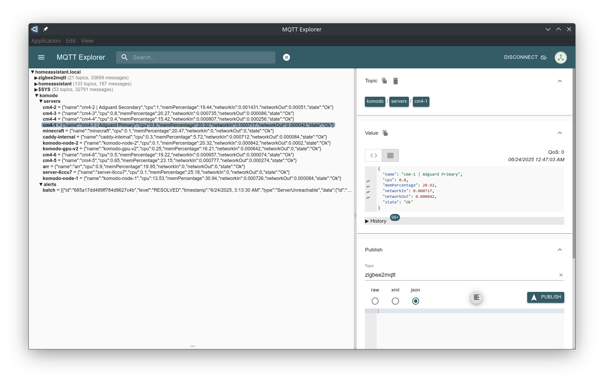

# Komodo MQTT Integration

Send Komodo server information to MQTT for real-time server monitoring. Automatic Home Assistant configuration is optional for users who want to make use of [MQTT Discovery](https://www.home-assistant.io/integrations/sensor.mqtt/#processing-unix-epoch-timestamps). You can already track server stats in the Komodo UI, this simply exposes those stats to MQTT ~~for making pretty graphs in Home Assistant~~ for any potential use. 

---

## 🚀 Features

- Publishes Komodo server CPU, memory, and network stats to MQTT
- Publishes new and resolved alerts to MQTT
- Supports Home Assistant MQTT auto-discovery (opt-in)
- Example Home Assistant automation included for sending notifications to a configured device 

---
Server information is published to MQTT under the topic `komodo/servers/{server_name}` alongside any active alerts published to `komodo/alerts/batch`.


Make use of published MQTT data through Home Assistant to view server status over time 


Each server exposes to MQTT: 
- `cpu`: CPU usage %
- `memPercentage`: RAM usage %
- `networkIn`: Network ingress (MB)
- `networkOut`: Network egress (MB)
- `state`: Status of the server (Ok/NotOK/Disabled)
- `name`: Name of server as displayed in Komodo

These can then be tracked as individual sensors in Home Assistant for historical data

<p align="center">
  
</p>
Komodo alerts are published to MQTT, allowing push notifications to be sent through Home Assistant automations: 

<p align="center">
  
  
</p>


## 🔧 Prerequisites and Setup
You will need to have a broker configured in Home Assistant already. If you want to make use of the MQTT discovery feature, you must be able to write events to `homeassistant/sensor/*`. 

## 🐳 Docker

### (Preferred) Docker Compose 
A sample compose and env file are provided under `sample.compose.yaml` and `sample.env`. Copy these to `compose.yaml` and `.env` respectively. 

```yaml
services:
  komodo-mqtt:
    image: ghcr.io/zuhayrali/komodo-mqtt:latest 
    # Referencing by digest is preferred
    # image: ghcr.io/zuhayrali/komodo-mqtt@sha256:hash   
    environment:
      - KOMODO_URL=${KOMODO_URL}
      - KOMODO_KEY=${KOMODO_KEY}
      - KOMODO_SECRET=${KOMODO_SECRET}
      - MQTT_URL=${MQTT_URL}
      - MQTT_USER=${MQTT_USER}
      - MQTT_PASS=${MQTT_PASS}
      # - UPDATE_INTERVAL= 60 # optional, time to wait in seconds between querying Komodo
      # - UPDATE_HOME_ASSISTANT=true # optional, when true, sensor values will be updated in homeassistant through MQTT discovery
```

### Environment Variables


| Variable              | Description                                                                | Required | Default | Example                      |
|-----------------------|----------------------------------------------------------------------------|----------|---------|----------------------------  |
| KOMODO_URL            | Your Komodo instance URL                                                   | y        | —       | `https://komodo.example.com` |
| KOMODO_KEY            | Komodo API Key                                                             | y        | —       | your_komodo_key              |
| KOMODO_SECRET         | Komodo Secret Key                                                          | y        | —       | your_komodo_secret           |
| MQTT_URL              | URL of your MQTT broker                                                    | y        | —       | mqtt://192.168.1.100:1883    |
| MQTT_USER             | Username for your MQTT broker                                              | y        | —       | mqtt_user                    |
| MQTT_PASS             | Password for your MQTT broker                                              | y        | —       | mqtt_password                |
| UPDATE_INTERVAL       | Interval in seconds between querying Komodo for updates                    | n        | 60      | 120                          |
| UPDATE_HOME_ASSISTANT | Flag to send sensor data to Home Assistant via MQTT discovery (true/false) | n        | false   | true                         |

After modifying your environment variables, start the container: `docker compose up -d`.  

---

### Build Locally

```bash
docker build -t komodo-mqtt .
docker run -d --env-file .env komodo-mqtt
```

### Use From GitHub Container Registry

```bash
docker pull ghcr.io/zuhayrali/komodo-mqtt:latest
docker run -d --env-file .env ghcr.io/zuhayrali/komodo-mqtt:latest
```

To use a specific digest:

```bash
docker pull ghcr.io/zuhayrali/komodo-mqtt@sha256:<digest>
```

---

## 🏠 Home Assistant Integration

### Using MQTT Discovery

If `UPDATE_HOME_ASSISTANT=true`, MQTT discovery messages are published under:

```
homeassistant/sensor/komodo/<server>_<metric>
```

Metrics include:
- `cpu`: CPU usage %
- `memPercentage`: RAM usage %
- `networkIn`: Network ingress (MB)
- `networkOut`: Network egress (MB)

For a server named `ooga` you would have access to: 
- `ooga_cpu`
- `ooga_ram`
- `ooga_net_in`
- `ooga_net_out` 

If your server name is separated by spaces, ex: `ooga booga`, then the MQTT sensor base name will be `ooga`.


### Example Discovery Payload

```json
{
  "name": "CPU Usage",
  "object_id": "ooga_cpu",
  "state_topic": "komodo/servers/ooga",
  "value_template": "{{ value_json.cpu }}",
  "unique_id": "ooga_cpu",
  "device": {
    "identifiers": ["ooga"],
    "name": "ooga"
  },
  "unit_of_measurement": "%"
}

```

Created servers can be accessed as devices under MQTT in Home Assistant in the format `komodo_serverName`

<p align="center">
  
</p>

### Manually editing configuration.yaml
If you'd prefer to add these sensor values manually, you'll need to use the published server MQTT topic. You can reference the [Home Assistant Documentation](https://www.home-assistant.io/integrations/sensor.mqtt/) for their instructions on how to do that. The `state_topic` value will be in the format `komodo/servers/your_server_name`


---

## 📦 MQTT Topics and Payloads

This integration publishes the following topics to your MQTT broker:

### 🔄 Server Stats

- **Topic Format:**
  ```
  komodo/servers/<serverName>
  ```

- **Payload Example:**

  ```json
  {
    "name": "caddy-internal",
    "cpu": 2.93,
    "memPercentage": 5.8,
    "networkIn": 9.494152,
    "networkOut": 9.48559,
    "state": "Ok"
  }
  ```

- **Field Descriptions:**
  - `cpu`: CPU usage percentage (%)
  - `memPercentage`: RAM usage percentage (%)
  - `networkIn`: Network ingress in megabytes (MB)
  - `networkOut`: Network egress in megabytes (MB)
  - `state`: Status of the server (Ok/NotOK/Disabled)
  - `name`: Name of server as displayed in Komodo

Messages are published on each update interval for every server discovered via the Komodo API.

---

### 🚨 Alerts (New and Resolved)

- **Topic:**
  ```
  komodo/alerts/batch
  ```

- **Payload Example:**

  ```json
  [
    {
      "id": "665f8934329d5d97e7fe438a",
      "level": "CRITICAL",
      "timestamp": "2025-06-23 14:42:01",
      "type": "disk_space_low",
      "data": {
        "server": "cm4-3",
        "volume": "/dev/sda1",
        "free": "1.2GB"
      }
    },
    {
      "id": "665f8934329d5d97e7fe438a",
      "level": "RESOLVED",
      "timestamp": "2025-06-23 15:12:01",
      "type": "disk_space_low",
      "data": {
        "server": "cm4-3",
        "volume": "/dev/sda1"
      },
      "resolved": true
    }
  ]
  ```

- **Behavior:**
  - New alerts are published with full metadata.
  - When an alert is resolved, a follow-up message is published with the same ID, `level: "RESOLVED"`, and `resolved: true`.

These messages can be used to drive automations in Home Assistant or other systems that consume MQTT events.

This is the automation that I use for sending notifications today, you'll need to modify it to be your actual notification target. 

```yaml
alias: Komodo - Push Alerts to Mobile App
triggers:
  - topic: komodo/alerts/batch
    trigger: mqtt
actions:
  - repeat:
      for_each: "{{ alerts }}"
      sequence:
        - data:
            title: Komodo - {{ repeat.item.level }}
            message: "{{ repeat.item.data.name }} ({{ repeat.item.type }})"
          action: notify.mobile_app_iphone_16
variables:
  alerts: "{{ trigger.payload_json }}"
```

---
